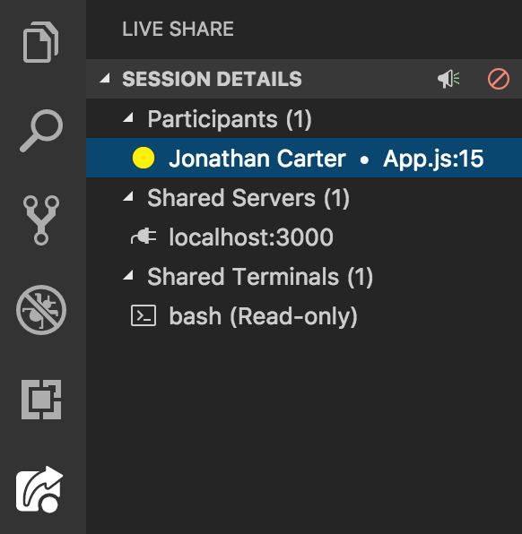
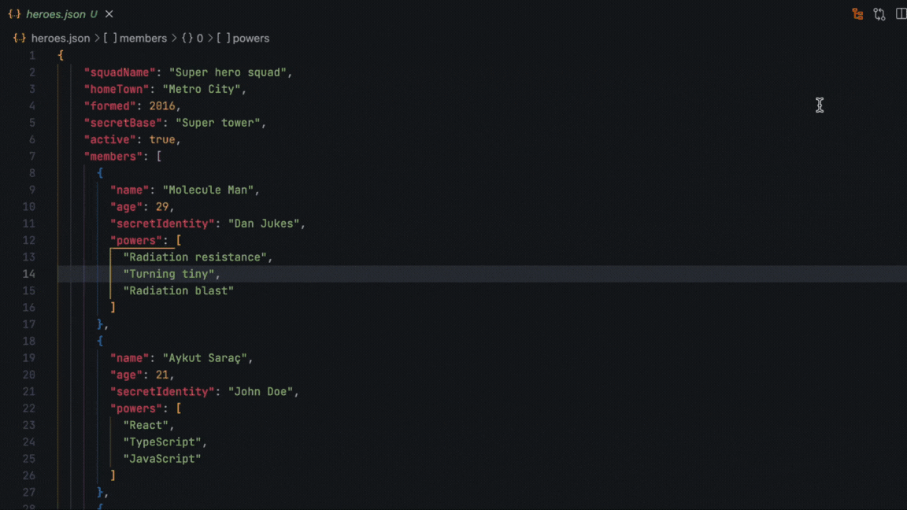

<!--
theme: uncover
headingDivider: 3
paginate: true
-->

<!--
_class:
 - lead
 - invert
-->

# Visual Studio Code <!--fit-->
<!-- _paginate: skip -->

Tips and Tricks

## Foreword
<!-- _paginate: skip -->

📝 Contribute on [ GitHub](https://github.com/peterneave/vscode)

🔗 View Online [neave.dev/vscode](https://neave.dev/vscode)

⬇️ Download [PowerPoint](https://neave.dev/vscode/vscode.pptx) and [PDF](https://neave.dev/vscode/vscode.pdf)

## What is VS Code?

> Visual Studio Code is a free code editor that is optimized for building and debugging modern web and cloud applications.

You can run it on Windows, Linux, Mac or Online <https://vscode.dev>

---

Key Features:

* It supports a range of languages,
* Productivity shortcut circuits
  - Keyboard shortcuts
  - Tasks
  - Snippets
* Customizable with
  - Themes
  - Extensions
* Integrated terminal.

## Documentation and Updates

- [Official Documentation](https://code.visualstudio.com/docs)
  - [Intro Videos](https://code.visualstudio.com/docs/getstarted/introvideos)
  - [Tips and Tricks](https://code.visualstudio.com/docs/getstarted/tips-and-tricks)
  - [Updates](https://code.visualstudio.com/updates)
- [VSCode YouTube Channel](https://www.youtube.com/@code)


## Inbuilt Features
<!-- footer: Inbuilt Features -->

### Help Menu

* [Keyboard shortcut reference](https://code.visualstudio.com/shortcuts/keyboard-shortcuts-windows.pdf)
* Walkthroughs
* Interactive Editor Playground
  - 

## Settings

### Profiles


VS Code has a Default Profile. Customize Settings, Keyboard Shortcuts, User Snippets, User Tasks or  Extensions.

You can have additional [profiles](https://code.visualstudio.com/docs/editor/profiles).

---

- Have a profile for Frontend, Backend, AWS and Azure or a Project.
- Customize the profile for a stack ie (Jira, AWS and Python).
- You could install the tools and extensions as part of that project.

## Customisation

- Edit the setings via the UI or the underlying JSON.
- [Default settings](https://code.visualstudio.com/docs/getstarted/settings#_default-settings) or open `Preferences: Open Default Settings (JSON)`
- Customize the User settings `Ctrl+,` (UI) - `Ctrl+P` and go to `Open User Settings (JSON)`

```json
{
  "editor.fontFamily": "'Cascadia Code'",
  "editor.formatOnSave": true,
  "editor.rulers": [ 120 ],
  "editor.stickyScroll.enabled": true,
  "editor.trimAutoWhitespace": true,
  "explorer.fileNesting.enabled": true,
  "files.trimTrailingWhitespace": true,
  "git.branchPrefix": "yourusername/",
  "terminal.integrated.fontFamily": "'CaskaydiaCove Nerd Font Mono','Cascadia Code',Consolas,'Courier New',monospace",
  "workbench.sideBar.location": "right"
}
```

### Synchronized Settings


[Settings sync](https://code.visualstudio.com/docs/editor/settings-sync) across multiple instances of VS Code

## Layout


### Customize the layout

- You could move the sidebar to the right then when you `Toggle Sidebar/Ctrl+B` it doesn't make the code jump around.
- Add a secondary sidebar with Outline view for better navigation.

### Grouping

`Ctrl+\`


---

Switch to next group with `Ctrl+[1,2,3...]`


Alternatively: `Ctrl+P` and `View: Move Editor to Next Group`

## Navigation

`Ctrl+R` Displays a Quick Pick dropdown with the list from `File > Open Recent` with recently opened folders and workspaces followed by files.

### Multi-Root Workspaces

Normally your workspace has a single root/project folder but you can have a workspace with multiple project folders in Visual Studio Code with [multi-root workspaces](https://code.visualstudio.com/docs/editor/multi-root-workspaces). Uses a `.code-workspace` file

---

```json
{
  "folders": [
    {
      // Source code
      "name": "Product",
      "path": "vscode"
    },
    {
      // Docs and release notes
      "name": "Documentation",
      "path": "vscode-docs"
    },
    {
      // Yeoman extension generator
      "name": "Extension generator",
      "path": "vscode-generator-code"
    }
  ]
}
```

### Command Palette


`Ctrl+Shift+P`

### Quick Open File


`Ctrl+P`

---


`Ctrl+P` and type `?term` to open a new terminal

### Others

`Ctrl+T` - Go To Symbol
`Ctrl+G` - Go to Line
`Alt+ ← / →` - Jump forward and back

## Editing

### Text Manipulation

- Sort Lines Ascending/Descending
- Join Lines
- Transform Text

---

| Tranform | Example                  |
| -------: | :----------------------- |
|    Title | Hello World              |
|    Upper | HELLO WORLD              |
|    Lower | hello world              |
|    Camel | helloWorld               |
|    Snake | helloWorld → hello_world |
|    Kebab | helloWorld → hello-world |

### Code Formatting


### Regex Search and Replace


### Multi Cursor

Edit Text Vertically with [multi-cursor](https://code.visualstudio.com/docs/getstarted/tips-and-tricks#_multi-cursor-selection)

Keep selecting text with `Ctrl+D` and update over multiple locations in a file.


### Expanding and Shrinking Selection

Shift+Alt+Left and Shift+Alt+Right

Find the start and end of a long `<div>` in HTML


### Folding

Hide Text for easier reading


Fold Level [1|2|3|4], Fold All, Unfold All

### Sticky Scroll

See the code context with Sticky Scroll - useful for long methods


### Emmet

Generate HTML and CSS from shorthand. Works with multi-cursors


### Markdown preview


## Productivity / Focus

### Zen Mode

Focus on the code with Zen Mode


### Errors

Jump to the [next error](https://code.visualstudio.com/Docs/editor/editingevolved#_errors-warnings) with `F8`.

Really useful for going through compiler errors.

### File Nesting

[Nest](https://code.visualstudio.com/updates/v1_67#_explorer-file-nesting) related files under a parent file in the explorer.


```json
"explorer.fileNesting.patterns": {
    "*.component.ts": "$(capture).component.html, $(capture).component.spec.ts, $(capture).component.scss",
    "README*": "AUTHORS,CHANGELOG*,CODE_OF_CONDUCT*,CONTRIBUTING*,LICENSE*"
  }
```

### Pinned Tabs

[Pinned Tabs](https://code.visualstudio.com/docs/editor/custom-layout#_pinned-tabs) allow you to keep a file open


### Vertical Rulers

Make sure your code isn't getting too long and hard to read.


### LogPoints

Non-breaking [log points](https://code.visualstudio.com/blogs/2018/07/12/introducing-logpoints-and-auto-attach#_introducing-logpoints) to show logging


### Screencast Mode


### Task Runners

Run tasks like build, test and other custom tasks in [Task Runners](https://code.visualstudio.com/docs/getstarted/tips-and-tricks#_task-runner).


### Remote Development

|                                                                                                                       Remote | Description                                                 |
| ---------------------------------------------------------------------------------------------------------------------------: | :---------------------------------------------------------- |
|                                                     [Remote via SSH](https://code.visualstudio.com/docs/remote/ssh-tutorial) | Connect to remote machines with Visual Studio Code via SSH. |
|                                                        [Work in WSL](https://code.visualstudio.com/docs/remote/wsl-tutorial) | Work in Windows Subsystem for Linux.                        |
|                                           [Develop in Containers](https://code.visualstudio.com/docs/devcontainers/tutorial) | Work in a Docker Container.                                 |
| [GitHub Codespaces](https://docs.github.com/github/developing-online-with-codespaces/using-codespaces-in-visual-studio-code) | Work in codespace with Visual Studio Code.                  |

---

#### Dev Containers

[Dev Containers](https://code.visualstudio.com/docs/devcontainers/containers) uses a `devcontainer.json` file in your project tells VS Code how to access (or create) a development container with a well-defined tool and runtime stack.

You can use [prebuild images](https://youtu.be/M21loGvplVM) to dev container setup. Also supports switching between [multiple containers](https://youtu.be/bVmczgfeR5Y)

---


## Extensions
<!-- footer: Extensions -->

### Installation

Install extensions with `Ctrl+Shift+X`. You can add to the workspace `@recommended` extensions for a project.

[Most Popular](https://marketplace.visualstudio.com/search?target=VSCode&category=All%20categories&sortBy=Installs) extensions can be found with `@popular`

### Extension Packs


[Extension Packs](https://marketplace.visualstudio.com/search?target=VSCode&category=Extension%20Packs&sortBy=Installs)

## Marp

This slide deck was written in Markdown within VSCode. I used the [Marp for VS Code](https://marketplace.visualstudio.com/items?itemName=marp-team.marp-vscode) extension to preview it.

[Marp](https://marp.app) has a CLI - so this slide has a CICD pipeline 😁

### Peacock


[Peacock](https://marketplace.visualstudio.com/items?itemName=johnpapa.vscode-peacock) allows you to colour code VS Code.

### IntelliCode

AI-assisted development features for Python, TypeScript/JavaScript and Java developers

[IntelliCode](https://marketplace.visualstudio.com/items?itemName=VisualStudioExptTeam.vscodeintellicode)


### LiveServer


Launch a development local Server with live reload feature for static & dynamic pages

[LiveServer](https://marketplace.visualstudio.com/items?itemName=ritwickdey.LiveServer)

### Indent Rainbow

[Indent Rainbow](https://marketplace.visualstudio.com/items?itemName=oderwat.indent-rainbow) makes indentation more readable. Highlights when you get indenting wrong.


### Path Intellisense


[Path Intellisense](https://marketplace.visualstudio.com/items?itemName=christian-kohler.path-intellisense) autocompletes filenames

### Code Spell Checker


[Code Spell Checker](https://marketplace.visualstudio.com/items?itemName=streetsidesoftware.code-spell-checker) for source code

### Error Lens

Improve highlighting of errors, warnings and other language diagnostics.

[Error Lens](https://marketplace.visualstudio.com/items?itemName=usernamehw.errorlens)


### Inline Fold


[Inline fold](https://marketplace.visualstudio.com/items?itemName=moalamri.inline-fold) A custom decorator that "fold" matching content in single line. Helps with Tailwind CSS.


### Polacode


📸  Polaroid for your code. Take screenshots of your code

[Polacode](https://marketplace.visualstudio.com/items?itemName=pnp.polacode)

### LiveShare

Real-time collaborative development from the comfort of your favourite tools.



[LiveShare](https://marketplace.visualstudio.com/items?itemName=MS-vsliveshare.vsliveshare) / [Docs](https://code.visualstudio.com/learn/collaboration/live-share)

### Jira and Bitbucket

Bringing the power of Jira and Bitbucket to VS Code

- You can create and view issues
- Start work on issues
- Create pull requests
- Do code reviews
- Start builds
- Get build statuses and more!

[Jira and Bitbucket](https://marketplace.visualstudio.com/items?itemName=Atlassian.atlascode)

### GitHub Copilot

[GitHub Copilot](https://marketplace.visualstudio.com/items?itemName=GitHub.copilot) Your AI pair programmer


### C# Dev Kit

Official C# extension from Microsoft

- Project System / Solution Explorer
- Code Editing (Uses the C# extension)
- Package Management
- Debugging
- Testing

[C# Dev Kit](https://marketplace.visualstudio.com/items?itemName=ms-dotnettools.csdevkit)

### Polygot Notebooks


[Polygot Notebooks](https://marketplace.visualstudio.com/items?itemName=ms-dotnettools.dotnet-interactive-vscode) allows

C#, F#, PowerShell, JavaScript, SQL, KQL, Python, R, HTML, HTTP, Mermaid.

### API Clients

[REST Client](https://marketplace.visualstudio.com/items?itemName=humao.rest-client)

```http
GET https://example.com/topics/1 HTTP/1.1

POST https://example.com/comments HTTP/1.1
content-type: application/json

{
    "name": "sample",
    "time": "Wed, 21 Oct 2015 18:27:50 GMT"
}
```

```sh
curl https://www.example.com
```

---


[Thunder Client](https://marketplace.visualstudio.com/items?itemName=rangav.vscode-thunder-client)

Lightweight Rest API Client for VS Code

### Better Comments


[Better Comments](https://marketplace.visualstudio.com/items?itemName=aaron-bond.better-comments) colour codes your commit messages

### TODO Tree

[TODO Tree](https://marketplace.visualstudio.com/items?itemName=Gruntfuggly.todo-tree) quickly find all your todo items.


### Conventional Commits


[Conventional Commits](https://marketplace.visualstudio.com/items?itemName=vivaxy.vscode-conventional-commits)

```text
<type>[optional scope]: <description>

[optional body]

[optional footer(s)]
```

---

Follows [conventionalcommits.org](https://www.conventionalcommits.org) and uses [gitmoji](https://gitmoji.dev) which then dovetails to [semver.org](https://semver.org)

```
feat(api): ✨ Add Get User Endpoint

Allow users to access their profile

ABC-123
```


### Unique Lines

Keep [unique lines](https://marketplace.visualstudio.com/items?itemName=bibhasdn.unique-lines) of text and remove duplicates from current selection. Also includes a command to shuffle currently selected lines.

```text
A    A
B => B
B    C
C
C
```

### Encode Decode

[Encode Decode](https://marketplace.visualstudio.com/items?itemName=mitchdenny.ecdc) converts text.

- Convert String **to/from** Base64, HTML Entities, JSON Byte Array, JSON String, Unicode, XML Entities
- Convert String to MD5/SHA1/SHA256/SHA512 (as Base64 or Hex)

### Bookmarks


[Bookmark](https://marketplace.visualstudio.com/items?itemName=alefragnani.Bookmarks) your code and quickly jump to bookmarks.

### Markdown Preview Mermaid Support


[Markdown Preview Mermaid Support](https://marketplace.visualstudio.com/items?itemName=bierner.markdown-mermaid) allows you to create [Mermaid JS](https://mermaid.js.org/) documents that can be included in Markdown documents.


---

Aside: Mermaid JS can generate

- Generate Flowchart
- Sequence Diagram
- Class Diagram
- State Diagram
- Entity Relationship Diagram
- User Journey
- Gantt
- Pie Chart
- Quadrant Chart
- Requirement Diagram

---


### JSON Crack



[JSON Crack](https://marketplace.visualstudio.com/items?itemName=AykutSarac.jsoncrack-vscode) seamlessly visualize your JSON data instantly into graphs.

### SemanticDiff


[SemanticDiff](https://marketplace.visualstudio.com/items?itemName=semanticdiff.semanticdiff) is a programming language aware diffs.

Can show differences when you move code.

### FootSteps


[FootSteps](https://marketplace.visualstudio.com/items?itemName=Wattenberger.footsteps) Highlight and navigate between your most recently edited chunks of code

### Pets for your VS Code


[Pets](https://marketplace.visualstudio.com/items?itemName=tonybaloney.vscode-pets) gives you a virtual pet to play with while you are coding.


### Database Connections


- [SQL Server](https://marketplace.visualstudio.com/items?itemName=ms-mssql.mssql)
- [MySQL](https://marketplace.visualstudio.com/items?itemName=formulahendry.vscode-mysql)
- [PostgreSQL](https://marketplace.visualstudio.com/items?itemName=ckolkman.vscode-postgres)
- [MongoDB for VS Code](https://marketplace.visualstudio.com/items?itemName=mongodb.mongodb-vscode)
- [Redis](https://marketplace.visualstudio.com/items?itemName=cweijan.vscode-redis-client)

### Docker


Makes it easy to create, manage, and debug containerized applications.

[Docker](https://marketplace.visualstudio.com/items?itemName=ms-azuretools.vscode-docker)

### Azure Tools


Get web site hosting, SQL and MongoDB data, Docker Containers, Serverless Functions and more, all on Azure.

[Azure Tools](https://marketplace.visualstudio.com/items?itemName=ms-vscode.vscode-node-azure-pack)

### AWS Toolkit


Including CodeWhisperer, CodeCatalyst, and support for Lambda, S3, CloudWatch Logs, and many other services

[AWS Toolkit](https://marketplace.visualstudio.com/items?itemName=AmazonWebServices.aws-toolkit-vscode)
