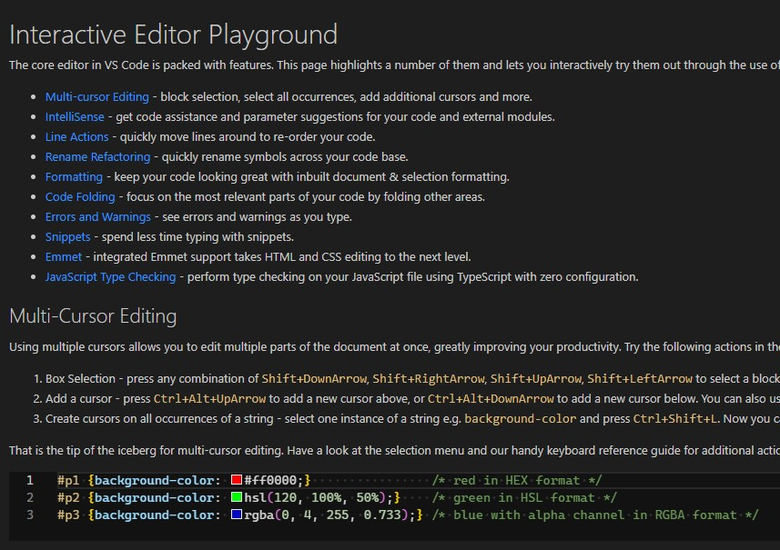
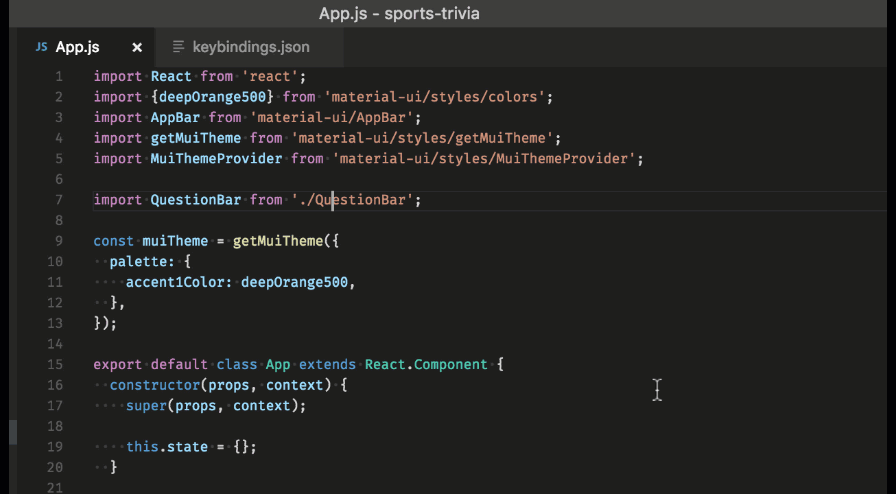
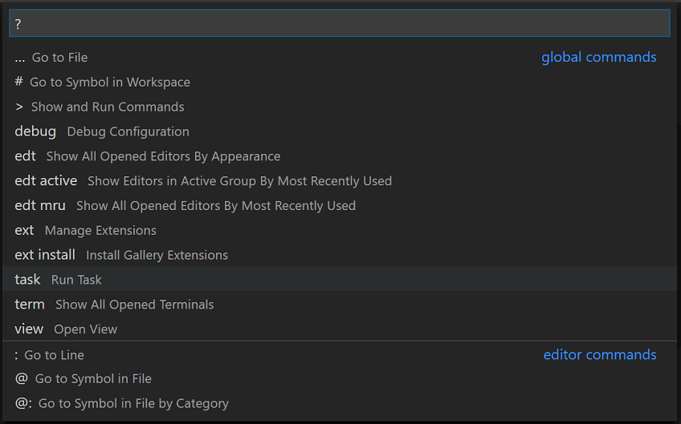
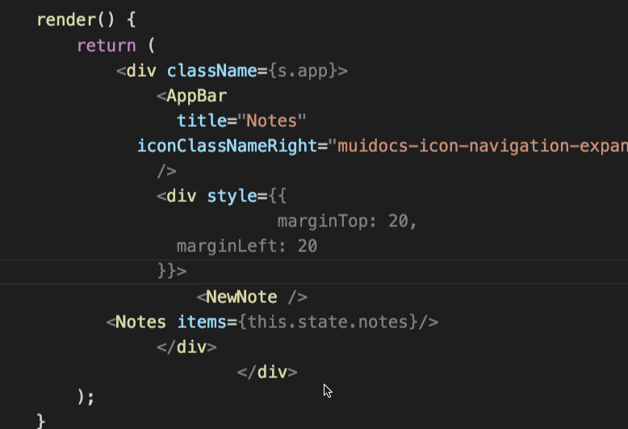
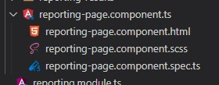

<!--
_class:
 - lead
 - invert
-->

# Visual Studio Code <!--fit-->
<!-- _paginate: skip -->

Tips and Tricks

## Foreword
<!-- _paginate: skip -->

📝 Contribute on [ GitHub](https://github.com/peterneave/vscode)

🔗 View Online [neave.dev/vscode](https://neave.dev/vscode)

⬇️ Download [PowerPoint](https://neave.dev/vscode/vscode.pptx) and [PDF](https://neave.dev/vscode/vscode.pdf)

## Documentation and Updates

<!-- - [Official Documentation](https://code.visualstudio.com/docs)
  - [Intro Videos](https://code.visualstudio.com/docs/getstarted/introvideos)
  - [Tips and Tricks](https://code.visualstudio.com/docs/getstarted/tips-and-tricks)
  - [Updates](https://code.visualstudio.com/updates)
- [YouTube](https://www.youtube.com/@code) -->

|                                               Topic | Sub-Topic                                                                        |
| --------------------------------------------------: | :------------------------------------------------------------------------------- |
| [Documentation](https://code.visualstudio.com/docs) |                                                                                  |
|                                                     | [Intro Videos](https://code.visualstudio.com/docs/getstarted/introvideos)        |
|                                                     | [Tips and Tricks](https://code.visualstudio.com/docs/getstarted/tips-and-tricks) |
|                                                     | [Updates](https://code.visualstudio.com/updates)                                 |
|            [YouTube](https://www.youtube.com/@code) |                                                                                  |

## Inbuilt Features
<!-- footer: Inbuilt Features -->

### Help Menu

* [Keyboard Shortcut reference](https://code.visualstudio.com/shortcuts/keyboard-shortcuts-windows.pdf)
* Walkthroughs
* Editor Playground



## Settings

### Synchronized Settings

https://code.visualstudio.com/docs/editor/settings-sync

## Customisation

[Default settings](https://code.visualstudio.com/docs/getstarted/settings#_default-settings)

Ctrl+P and go to `Open User Settings (JSON)`

```json
{
  "editor.fontFamily": "'Cascadia Code'",
  "editor.formatOnSave": true,
  "editor.rulers": [ 120 ],
  "editor.stickyScroll.enabled": true,
  "editor.trimAutoWhitespace": true,
  "explorer.fileNesting.enabled": true,
  "files.trimTrailingWhitespace": true,
  "git.branchPrefix": "yourusername/",
  "terminal.integrated.fontFamily": "'CaskaydiaCove Nerd Font Mono','Cascadia Code',Consolas,'Courier New',monospace",
  "workbench.sideBar.location": "right"
}
```

### Profiles

VS Code has a Default Profile.
Use additional [profiles](https://code.visualstudio.com/docs/editor/profiles) for

- Settings
- Keyboard Shortcuts
- User Snippets
- User Tasks
- Extensions

Have a profile for frontend,backend,AWS and Azure


## Display

Toggle Sidebar (Ctrl+B). Move the sidebar to the right

`workbench.sideBar.location: "right"`

Add a secondary sidebar with Outline view for better navigation

### Zen Mode


## Navigation

### Navigate between recently opened files and workspaces

<kbd>Ctrl+R</kbd>

### Multi-Root Workspaces

You can work with multiple project folders in Visual Studio Code with [multi-root workspaces](https://code.visualstudio.com/docs/editor/multi-root-workspaces).

---

```json
{
  "folders": [
    {
      // Source code
      "name": "Product",
      "path": "vscode"
    },
    {
      // Docs and release notes
      "name": "Documentation",
      "path": "vscode-docs"
    },
    {
      // Yeoman extension generator
      "name": "Extension generator",
      "path": "vscode-generator-code"
    }
  ]
}
```


### Command Palette

Ctrl+Shift+P 

### Quick Open File

Ctrl+P 



Ctrl+B (right side)

### Sticky Scroll


## Editing

### Text Manipulation

- Sort Lines Ascending/Descending
- Transform Text


| Tranform | Example     |
| -------: | :---------- |
|    Title | Hello World |
|    Upper | HELLO WORLD |
|    Lower | hello world |
|    Camel | helloWorld  |
|    Snake | hello_world |
|    Kebab | hello-world |

### Code Formatting



### Regex Search and Replace


### Multi Cursor (CTRL+D)

Edit Text Vertically with [multi-cursor](https://code.visualstudio.com/docs/getstarted/tips-and-tricks#_multi-cursor-selection)


### Expanding and Shrinking Selection

Shift+Alt+Left and Shift+Alt+Right

Ever tried to find the start and end of a large `<div></div>` ?


### Folding

Hide Text for easier reading


Fold Level X, Fold All, Unfold All

### Emmet

Generate HTML from shorthand


Works with multi-cursors

### Markdown preview


## Productivity / Focus

### Next Problem in Files

<kbd>F8</kbd>

https://code.visualstudio.com/Docs/editor/editingevolved#_errors-warnings

### File Nesting

[Nest](https://code.visualstudio.com/updates/v1_67#_explorer-file-nesting) related files under a parent file in the explorer.

```json
"explorer.fileNesting.patterns": {
    "*.component.ts": "$(capture).component.html, $(capture).component.spec.ts, $(capture).component.scss",
  }
```



### Pinned Tabs


https://code.visualstudio.com/docs/editor/custom-layout#_pinned-tabs

### Vertical Rulers

Make sure your code isn't getting too long and hard to read.


### Grouping

Ctrl+\


Ctrl+1,Ctrl+2


Ctrl+P and `View: Move Editor to Next Group`


### LogPoints

Non-breaking [log points](https://code.visualstudio.com/blogs/2018/07/12/introducing-logpoints-and-auto-attach#_introducing-logpoints) to show logging


### Screencast Mode


### Terminal

Run commands from the terminal without leaving VS Code.

### Task Runners

Run tasks like build, test and other custom tasks in [Task Runners](https://code.visualstudio.com/docs/getstarted/tips-and-tricks#_task-runner).


### Developer Containers

A devcontainer.json file in your project tells VS Code how to access (or create) a development container with a well-defined tool and runtime stack. https://code.visualstudio.com/docs/devcontainers/containers

---


## Extensions
<!-- footer: Extensions -->

ctrl+shift+x

@recommended

Most Popular https://marketplace.visualstudio.com/search?target=VSCode&category=All%20categories&sortBy=Installs

`@popular`


## Marp

This slide deck written in Markdown within VSCode. I used the Marp extension to export to PowerPoint. <https://marp.app/>

Side note, Marp has a CLI - so this slide has a CICD pipeline 😁


### Extension Packs


[Extension Packs](https://marketplace.visualstudio.com/search?target=VSCode&category=Extension%20Packs&sortBy=Installs)

### C# Dev Kit

[C# Dev Kit](https://marketplace.visualstudio.com/items?itemName=ms-dotnettools.csdevkit)

Name: C# Dev Kit
Id: ms-dotnettools.csdevkit
Description: Official C# extension from Microsoft
Version: 1.0.14
Publisher: Microsoft
VS Marketplace Link: https://marketplace.visualstudio.com/items?itemName=ms-dotnettools.csdevkit

### IntelliCode

Name: IntelliCode
Id: VisualStudioExptTeam.vscodeintellicode
Description: AI-assisted development
Version: 1.2.30
Publisher: Microsoft
VS Marketplace Link: https://marketplace.visualstudio.com/items?itemName=VisualStudioExptTeam.vscodeintellicode

### LiveServer


[LiveServer](https://marketplace.visualstudio.com/items?itemName=ritwickdey.LiveServer)

Name: Live Server
Id: ritwickdey.LiveServer
Description: Launch a development local Server with live reload feature for static & dynamic pages
Version: 5.7.9
Publisher: Ritwick Dey
VS Marketplace Link: https://marketplace.visualstudio.com/items?itemName=ritwickdey.LiveServer

### CoPilot

Name: GitHub Copilot
Id: GitHub.copilot
Description: Your AI pair programmer
Version: 1.138.0
Publisher: GitHub
VS Marketplace Link: https://marketplace.visualstudio.com/items?itemName=GitHub.copilot

### Atlassian

Name: Jira and Bitbucket (Atlassian Labs)
Id: atlassian.atlascode
Description: Bringing the power of Jira and Bitbucket to VS Code - With Atlassian for VS Code you can create and view issues, start work on issues, create pull requests, do code reviews, start builds, get build statuses and more!
Version: 3.0.8
Publisher: Atlassian
VS Marketplace Link: https://marketplace.visualstudio.com/items?itemName=Atlassian.atlascode

### Azure

Name: Azure Tools
Id: ms-vscode.vscode-node-azure-pack
Description: Get web site hosting, SQL and MongoDB data, Docker Containers, Serverless Functions and more, all on Azure, all from VS Code, in this one extension from Microsoft.
Version: 1.2.0
Publisher: Microsoft
VS Marketplace Link: https://marketplace.visualstudio.com/items?itemName=ms-vscode.vscode-node-azure-pack

### AWS

Name: AWS Toolkit
Id: amazonwebservices.aws-toolkit-vscode
Description: Including CodeWhisperer, CodeCatalyst, and support for Lambda, S3, CloudWatch Logs, and many other services
Version: 1.100.0
Publisher: Amazon Web Services
VS Marketplace Link: https://marketplace.visualstudio.com/items?itemName=AmazonWebServices.aws-toolkit-vscode

### Docker

Name: Docker
Id: ms-azuretools.vscode-docker
Description: Makes it easy to create, manage, and debug containerized applications.
Version: 1.28.0
Publisher: Microsoft
VS Marketplace Link: https://marketplace.visualstudio.com/items?itemName=ms-azuretools.vscode-docker


### Error Lens

Name: Error Lens
Id: usernamehw.errorlens
Description: Improve highlighting of errors, warnings and other language diagnostics.
Version: 3.15.0
Publisher: Alexander
VS Marketplace Link: https://marketplace.visualstudio.com/items?itemName=usernamehw.errorlens

### Polacode

Name: Polacode
Id: pnp.polacode
Description: 📸  Polaroid for your code
Version: 0.3.4
Publisher: P & P
VS Marketplace Link: https://marketplace.visualstudio.com/items?itemName=pnp.polacode

### Polygot Notebooks

Name: Polyglot Notebooks
Id: ms-dotnettools.dotnet-interactive-vscode
Description: Polyglot Notebooks for VS Code. Use multiple languages in one notebook with full language server support for each language and share variables between them.
Version: 1.0.4562010
Publisher: Microsoft
VS Marketplace Link: https://marketplace.visualstudio.com/items?itemName=ms-dotnettools.dotnet-interactive-vscode

### RapidAPI Client

Name: RapidAPI Client
Id: RapidAPI.vscode-rapidapi-client
Description: RapidAPI Client is a full-featured HTTP client that lets you test and describes the APIs you build or consume. Designed to work with your VS Code themes, RapidAPI Client makes composing requests, inspecting responses, generating code, and types for application development simple and intuitive.
Version: 1.10.2
Publisher: RapidAPI
VS Marketplace Link: https://marketplace.visualstudio.com/items?itemName=RapidAPI.vscode-rapidapi-client

### Rest Client

Name: REST Client
Id: humao.rest-client
Description: REST Client for Visual Studio Code
Version: 0.25.1
Publisher: Huachao Mao
VS Marketplace Link: https://marketplace.visualstudio.com/items?itemName=humao.rest-client


### Todo Tree

Name: Todo Tree
Id: Gruntfuggly.todo-tree
Description: Show TODO, FIXME, etc. comment tags in a tree view
Version: 0.0.226
Publisher: Gruntfuggly
VS Marketplace Link: https://marketplace.visualstudio.com/items?itemName=Gruntfuggly.todo-tree

### Unique Lines

Name: Unique Lines
Id: bibhasdn.unique-lines
Description: Keep unique lines of text and remove duplicates from current selection. Also includes a command to shuffle currently selected lines.
Version: 1.0.0
Publisher: bibhasdn
VS Marketplace Link: https://marketplace.visualstudio.com/items?itemName=bibhasdn.unique-lines


### Decode

Name: Encode Decode
Id: mitchdenny.ecdc
Description: An extension for Visual Studio Code that allows you to quickly convert text selections.
Version: 1.8.0
Publisher: Mitch Denny
VS Marketplace Link: https://marketplace.visualstudio.com/items?itemName=mitchdenny.ecdc

### Bookmark

Name: Bookmarks
Id: alefragnani.Bookmarks
Description: Mark lines and jump to them
Version: 13.4.2
Publisher: Alessandro Fragnani
VS Marketplace Link: https://marketplace.visualstudio.com/items?itemName=alefragnani.Bookmarks

### Mermaid JS

Name: Markdown Preview Mermaid Support
Id: bierner.markdown-mermaid
Description: Adds Mermaid diagram and flowchart support to VS Code's builtin markdown preview
Version: 1.20.0
Publisher: Matt Bierner
VS Marketplace Link: https://marketplace.visualstudio.com/items?itemName=bierner.markdown-mermaid

### JSON Crack

Name: JSON Crack
Id: AykutSarac.jsoncrack-vscode
Description: Seamlessly visualize your JSON data instantly into graphs.
Version: 2.0.2
Publisher: Aykut Saraç
VS Marketplace Link: https://marketplace.visualstudio.com/items?itemName=AykutSarac.jsoncrack-vscode

### SemanticDiff


Name: SemanticDiff
Id: semanticdiff.semanticdiff
Description: Programming language aware diffs for Visual Studio Code.
Version: 0.8.7
Publisher: SemanticDiff
VS Marketplace Link: https://marketplace.visualstudio.com/items?itemName=semanticdiff.semanticdiff

[Semantic Diff](https://marketplace.visualstudio.com/items?itemName=semanticdiff.semanticdiff)

### FootSteps


Name: footsteps
Id: Wattenberger.footsteps
Description: Highlight and navigate between your most recently edited chunks of code
Version: 0.5.0
Publisher: Wattenberger
VS Marketplace Link: https://marketplace.visualstudio.com/items?itemName=Wattenberger.footsteps

[FootSteps](https://marketplace.visualstudio.com/items?itemName=Wattenberger.footsteps)

### VS Code Pets


Name: vscode-pets
Id: tonybaloney.vscode-pets
Description: Pets for your VS Code
Version: 1.25.1
Publisher: Anthony Shaw
VS Marketplace Link: https://marketplace.visualstudio.com/items?itemName=tonybaloney.vscode-pets

[Pets](https://marketplace.visualstudio.com/items?itemName=tonybaloney.vscode-pets)
